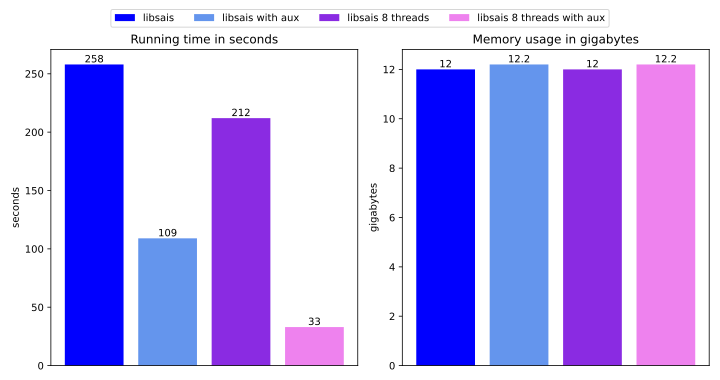

# An additional small benchmark about `libsais`auxiliary indices

The setup is the same as in the main benchmark, except that a BWT is created (in an owned buffer) and then reversed to the original text (also in an owned buffer).
In some of the benchmarks, an auxiliary indices array with sampling rate 32 is used (with aux), in others not. It can be observed that the auxiliary
indices improve performance a lot.

