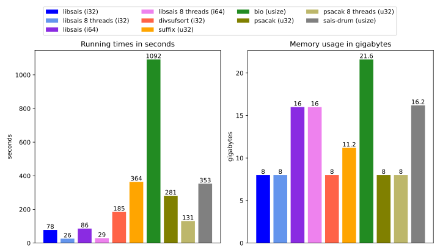

# Benchmark of suffix array construction algorithms available on crates.io

This is a very short and simple benchmark. It is not intended to be a comprehensive analysis of suffix array construction algorithms (SACAs) in general.

The goal is to roughly compare the performance of SACAs that are available for Rust developers on [crates.io].

[crates.io]: https://crates.io

## Participants

- [`libsais`](https://github.com/feldroop/libsais-rs): Rust bindings for the C library [`libsais`], supports multithreading optionally. (bias alert: I created the bindings)
- [`divsufsort`](https://github.com/fasterthanlime/stringsearch): A port of the C library [`divsufsort`].
- [`suffix`]: A library for UTF8-encoded (`str`) texts and not byte arrays `[u8]`. This library therefore solves a slightly different, tricky problem, and is only included out of curiosity.
- [`bio`]: A large package of algorithms and data structures for bioinformatics applications.
- [`psacak`]: A stand-alone Rust implementation of a SACA with multithreading support via `rayon`.
- [`sais-drum`]: A Rust implementation heavily inspired by [`libsais]`, unfinished and not fully optimized. This one is not availableon [crates.io] (bias alert: I created this library)

## Setup

- Input data: The first 2GB of the human genome. This makes sure that the libraries computing `i32`-based suffix arrays can participate. 
- The benchmarks were executed on a Windows laptop with an AMD Ryzen 7 PRO 8840HS (octa-core) processor and 32 GB of RAM.
- The libraries with multithreading support were instructed to use 8 threads.

## Results

The type of the indices of the returned suffix array is provided in the legend. It has a large influence on the memory usage and on the maximum text length that the library supports. 

All implementations except for [`suffix`] and [`bio`] do not need a significant amount of additional memory apart from the suffix array itself. [`libsais`] provides the fastest implementation and is among the most memory efficient ones. 
Only for texts of length between $2^{31}$ (~2.1G) and $2^{32} -1$ (~4.2G) for which indices don't fit into an `i32`, [`psacak`] might be a more memory efficient solution.

[`libsais`]: https://github.com/IlyaGrebnov/libsais
[`divsufsort`]: https://github.com/y-256/libdivsufsort
[`suffix`]: https://github.com/BurntSushi/suffix
[`bio`]: https://github.com/rust-bio/rust-bio
[`psacak`]: https://github.com/hucsmn/psacak
[`sais-drum`]: https://github.com/feldroop/sais-drum 
