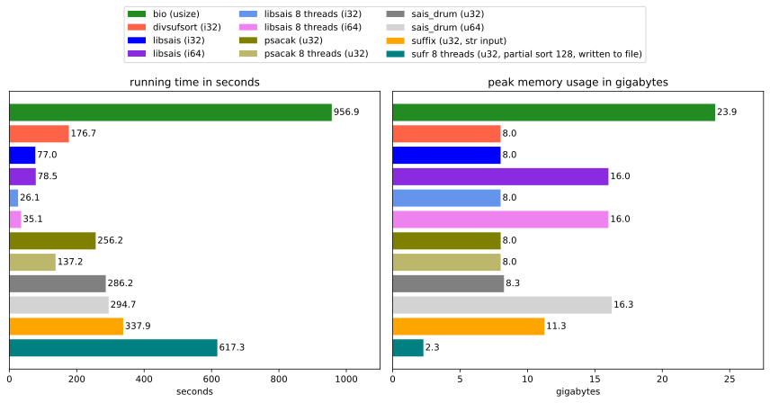

# Benchmark of suffix array construction algorithms available on crates.io

This is a very short and simple benchmark. It is not intended to be a comprehensive analysis of suffix array construction algorithms (SACAs) in general.

The goal is to roughly compare the performance of SACAs that are available for Rust developers on [crates.io].

## Participants

- [`libsais`](https://github.com/feldroop/libsais-rs): Rust bindings for the C library [`libsais`], supports multithreading optionally. (bias alert: I created the bindings)
- [`divsufsort`](https://github.com/fasterthanlime/stringsearch): A port of the C library [`divsufsort`].
- [`suffix`]: A library for UTF8-encoded (`str`) texts and not byte arrays `[u8]`. This library has to deal with the complexity of UTF-8 and comparing it to the other libraries is not entirely fair.
- [`bio`]: A large package of algorithms and data structures for bioinformatics applications.
- [`psacak`]: A stand-alone Rust implementation of a SACA with multithreading support via `rayon`.
- [`sais-drum`]: A Rust implementation heavily inspired by [`libsais`], unfinished and not fully optimized. (bias alert: I created this library)
- [`sufr`]: This library is special, because it allows constructiong a suffix array in chunks and writing the chunks to a file. By doing this, it achieves a very low memory usage. The algorithm is slower than the others, but it is CPU bound and can be sped up well using multithreading. Also, it is slowed down by inputs that contain long repeats, such as the human genome. To alleviate this issue, the library allows constructing a suffix array that is only sorted up to a given number of characters (partial sort). This number is set to 128 in this benchmark, which means that the comparison to the other libraries is not entirely fair.

## Setup

- Input data: The first 2GB of the human genome. This makes sure that the libraries computing `i32`-based suffix arrays can participate. 
- The benchmarks were executed on a Windows laptop with an AMD Ryzen 7 PRO 8840HS (octa-core) processor and 32 GB of RAM.
- The libraries with multithreading support were instructed to use 8 threads.

## Results

The type of the indices of the returned suffix array is provided in the legend. It has a large influence on the memory usage and on the maximum text length that the library supports. 

All implementations except for [`suffix`] and [`bio`] do not need a significant amount of additional memory apart from the suffix array itself. [`libsais`] provides the fastest implementation and is among the most memory efficient ones. 

Only for texts of length between $2^{31}$ (~2.1G) and $2^{32} -1$ (~4.2G) for which indices don't fit into an `i32`, [`psacak`] might be a more memory efficient solution.

The library [`sufr`] adds the useful capability to construct a suffix array in a file, with a very low memory footprint. Unlike [`libsais`], the algorithm of [`sufr`] is CPU bound and could be sped up further using more threads (in terms of wall time).

[crates.io]: https://crates.io
[`libsais`]: https://github.com/IlyaGrebnov/libsais
[`divsufsort`]: https://github.com/y-256/libdivsufsort
[`suffix`]: https://github.com/BurntSushi/suffix
[`bio`]: https://github.com/rust-bio/rust-bio
[`psacak`]: https://github.com/hucsmn/psacak
[`sais-drum`]: https://github.com/feldroop/sais-drum 
[`sufr`]: https://github.com/TravisWheelerLab/sufr
